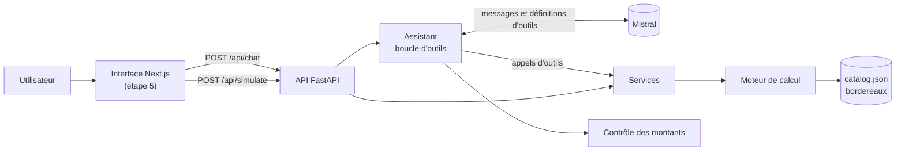

# Architecture

## Vue d'ensemble

| Couche | Dossier | Responsabilité |
|---|---|---|
| Moteur | `engine/` | Calcul déterministe, sans dépendance, chaque ligne justifiée |
| Services | `api/commission_api/services.py` | Cas d'usage : paramétrage, simulation, contrats d'exemple |
| Outils | `api/commission_api/assistant/tools.py` | Exposition des services au modèle, validation des arguments |
| Assistant | `api/commission_api/assistant/agent.py` | Boucle modèle ↔ outils, bornée, avec trace de chaque appel |
| API | `api/commission_api/routes.py` | HTTP, schémas OpenAPI typés |

Les routes HTTP et les outils du modèle appellent **les mêmes services** avec **les mêmes modèles de validation** : le simulateur de l'interface et l'assistant ne peuvent pas diverger.

## Décision : où tourne l'orchestration du modèle de langage ?

| | A. Routes Next.js (TypeScript) | B. API FastAPI (Python) — **retenue** |
|---|---|---|
| Appel du moteur | Requête HTTP vers l'API Python | Appel direct, dans le même processus |
| Types | Dupliqués entre TypeScript et Python | Pydantic → OpenAPI → types TypeScript générés |
| Évaluation (étape 3) | Doit passer par HTTP | Script Python qui appelle l'assistant directement |
| Clé API | Côté Next.js | Côté API, un seul endroit |
| Streaming | Fourni par le Vercel AI SDK | À implémenter en SSE (étape 4) |

**Choix : B.** Le moteur, les outils, le modèle de langage et l'évaluation vivent au même endroit, et l'interface reste purement présentationnelle. Le coût est d'implémenter soi-même le streaming des réponses, prévu à l'étape 4.

## Garde-fous sur les chiffres

Un montant faux présenté avec assurance est le risque principal. Trois niveaux de défense se complètent :

1. **Consigne** : le prompt système interdit au modèle de calculer. Tout montant, taux ou seuil doit venir d'un outil. Si une information manque, le modèle doit la demander.
2. **Architecture** : le seul moyen d'obtenir un chiffre est d'appeler le moteur via `simulate_contract`, `lookup_sample_contract` ou `get_perimeter_details`. Les résultats contiennent des montants déjà formatés, à recopier tels quels.
3. **Contrôle a posteriori** : chaque montant en euros de la réponse est comparé aux sources (résultats d'outils, règles de référence, messages de l'utilisateur). Un montant sans source est renvoyé dans `unverified_amounts`, que l'interface pourra signaler.

La boucle d'outils est bornée (4 tours par défaut). Au dernier tour, le modèle ne reçoit plus d'outils et doit conclure. Chaque appel d'outil (arguments, résultat, succès) est renvoyé au client pour le panneau « sous le capot ».

## Points d'entrée HTTP

| Méthode | Route | Rôle |
|---|---|---|
| GET | `/api/health` | État de l'API, assistant activé ou non |
| GET | `/api/perimeters` | Liste des périmètres |
| GET | `/api/perimeters/{code}` | Paramétrage détaillé et grilles de taux |
| POST | `/api/simulate` | Calcul d'un contrat entre M-1 et M |
| GET | `/api/samples/{perimeter}/contracts/{contract_id}` | Contrat d'exemple, son historique et son résultat |
| POST | `/api/chat` | Question à l'assistant : réponse, trace des outils, montants non vérifiés |

Documentation interactive : `http://localhost:8000/docs` une fois l'API lancée.
