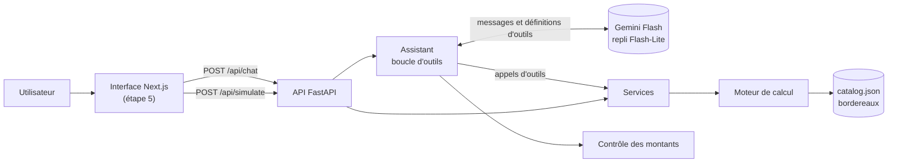

# Architecture

## Vue d'ensemble

| Couche | Dossier | Responsabilité |
|---|---|---|
| Moteur | `engine/` | Calcul déterministe, sans dépendance, chaque ligne justifiée |
| Services | `api/commission_api/services.py` | Cas d'usage : paramétrage, simulation, contrats d'exemple |
| Outils | `api/commission_api/assistant/tools.py` | Exposition des services au modèle, validation des arguments |
| Assistant | `api/commission_api/assistant/agent.py` | Boucle modèle ↔ outils, bornée, avec trace de chaque appel |
| API | `api/commission_api/routes.py` | HTTP, schémas OpenAPI typés |

Les routes HTTP et les outils du modèle appellent **les mêmes services** avec **les mêmes modèles de validation** : le simulateur de l'interface et l'assistant ne peuvent pas diverger.

## Décision : où tourne l'orchestration du modèle de langage ?

| | A. Routes Next.js (TypeScript) | B. API FastAPI (Python) — **retenue** |
|---|---|---|
| Appel du moteur | Requête HTTP vers l'API Python | Appel direct, dans le même processus |
| Types | Dupliqués entre TypeScript et Python | Pydantic → OpenAPI → types TypeScript générés |
| Évaluation (étape 3) | Doit passer par HTTP | Script Python qui appelle l'assistant directement |
| Clé API | Côté Next.js | Côté API, un seul endroit |
| Streaming | Fourni par le Vercel AI SDK | À implémenter en SSE (étape 4) |

**Choix : B.** Le moteur, les outils, le modèle de langage et l'évaluation vivent au même endroit, et l'interface reste purement présentationnelle. Le coût est d'implémenter soi-même le streaming des réponses, prévu à l'étape 4.

## Fournisseur du modèle de langage

Le code ne dépend d'aucun fournisseur : un client unique parle le format d'API d'OpenAI, que proposent Gemini, Groq, OpenRouter et Mistral. Changer de fournisseur revient à modifier `LLM_BASE_URL` et `LLM_MODELS`.

**Choix par défaut : Google Gemini**, dont le plan gratuit donne accès à des modèles récents conçus pour les appels d'outils, sans carte bancaire.

| Critère | Gemini (retenu) | Groq | OpenRouter `:free` | Mistral |
|---|---|---|---|---|
| Limite gênante du plan gratuit | Requêtes par jour sur les Flash récents | 8 000 tokens par minute, moins qu'une question de l'assistant (environ 7 000 tokens par appel) | 50 requêtes par jour | 2 requêtes par minute |
| Appels d'outils | Modèles récents prévus pour | Bons | Variables selon le modèle | Bons |

**Chaîne de repli.** Les modèles de `LLM_MODELS` sont essayés dans l'ordre : `gemini-3.5-flash-lite`, puis `gemini-3.7-flash`. L'ordre inverse était prévu au départ. L'évaluation l'a fait changer : sur le plan gratuit, `gemini-3.7-flash` a enchaîné les erreurs 503 et épuisé son quota journalier après une douzaine d'appels, alors que Flash-Lite réussit l'essentiel du jeu de référence (voir [evals/RAPPORT.md](../evals/RAPPORT.md)). Un modèle qui répond « quota atteint » (erreur 429) est mis de côté 60 secondes, un modèle surchargé ou injoignable (erreur 5xx, délai dépassé) 15 secondes, et le suivant prend le relais. Les surcharges sont fréquentes sur le plan gratuit : dès le premier essai réel, `gemini-3.7-flash` a répondu 503 « high demand ». Les erreurs définitives (requête refusée, clé invalide) ne déclenchent pas de repli. Si tous les modèles sont épuisés, l'API répond 429 ; s'ils sont indisponibles, 502. La réponse du chat indique le modèle qui a réellement répondu.

**Compatibilité.**
- Le message de l'assistant est renvoyé au modèle exactement tel qu'il l'a produit, champs propres au fournisseur compris. Les modèles Gemini 3 en ont besoin pour retrouver leurs signatures de raisonnement entre deux appels d'outils.
- Les schémas d'outils se limitent au sous-ensemble de JSON Schema accepté partout (pas de `format` ni de `pattern`). La validation stricte est faite ensuite par pydantic.
- La température n'est pas forcée : Google recommande la valeur par défaut pour Gemini 3.

## Garde-fous sur les chiffres

Un montant faux présenté avec assurance est le risque principal. Plusieurs niveaux de défense se complètent :

1. **Consigne** : le prompt système interdit au modèle de calculer. Tout montant, taux ou seuil doit venir d'un outil. Si une information manque, le modèle doit la demander. La liste exacte des produits figure dans le prompt.
2. **Architecture** : le seul moyen d'obtenir un chiffre est d'appeler le moteur via `simulate_contract`, `lookup_sample_contract` ou `get_perimeter_details`. Les résultats contiennent des montants déjà formatés, à recopier tels quels.
3. **Entrées contraintes** : les valeurs qui changent le taux (segments, garanties négociées) sont imposées par énumération dans la définition de l'outil. Le service refuse un segment inconnu au lieu d'appliquer silencieusement le taux standard.
4. **Contrôles a posteriori**, renvoyés avec chaque réponse :
   - `unverified_amounts` : montants en euros absents des sources (résultats d'outils, règles de référence, messages de l'utilisateur) ;
   - `citations` : règles citées dans le texte ou appliquées par le moteur, avec pour chacune `in_answer` et `from_calculation`. Une règle citée mais non appliquée mérite l'attention ; une règle appliquée mais non citée indique une explication incomplète ;
   - `unknown_rules` : identifiants de règle qui n'existent pas ;
   - `unknown_products` : noms de produits absents du catalogue, repérés par la marque (« Verdance Essentiel »).

## Streaming

`POST /api/chat/stream` renvoie un flux Server-Sent Events. L'interface peut ainsi montrer le déroulé en direct : outil lancé, résultat du moteur, texte au fil de l'écriture.

| Événement | Contenu |
|---|---|
| `tool_call` | Nom de l'outil et arguments, avant exécution |
| `tool_result` | Trace de l'appel : arguments, résultat, succès |
| `delta` | Fragment de texte. Un texte qui précède des appels d'outils n'est pas la réponse finale |
| `done` | Réponse complète, au même format que `POST /api/chat`, contrôles compris |
| `error` | `{status, detail}` : 429 quota épuisé, 502 modèle indisponible. Le flux s'arrête |

Les fragments d'appels d'outils reçus du fournisseur sont recollés, arguments JSON et champs propres au fournisseur compris, avant d'être renvoyés au modèle au tour suivant. Le repli sur un autre modèle reste possible tant qu'aucun fragment n'a été transmis. Au-delà, une erreur est signalée par l'événement `error`, car un texte déjà affiché ne peut pas être repris par un autre modèle.

La boucle d'outils est bornée (4 tours par défaut). Au dernier tour, le modèle ne reçoit plus d'outils et doit conclure. Chaque appel d'outil (arguments, résultat, succès) est renvoyé au client pour le panneau « sous le capot ».

## Points d'entrée HTTP

| Méthode | Route | Rôle |
|---|---|---|
| GET | `/api/health` | État de l'API, assistant activé ou non |
| GET | `/api/perimeters` | Liste des périmètres |
| GET | `/api/perimeters/{code}` | Paramétrage détaillé et grilles de taux |
| POST | `/api/simulate` | Calcul d'un contrat entre M-1 et M |
| GET | `/api/samples/{perimeter}/contracts/{contract_id}` | Contrat d'exemple, son historique et son résultat |
| POST | `/api/chat` | Question à l'assistant : réponse, trace des outils, citations et contrôles |
| POST | `/api/chat/stream` | Même question, en flux Server-Sent Events |

Documentation interactive : `http://localhost:8000/docs` une fois l'API lancée.
